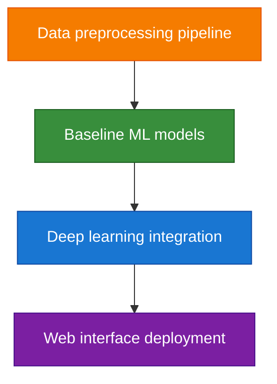
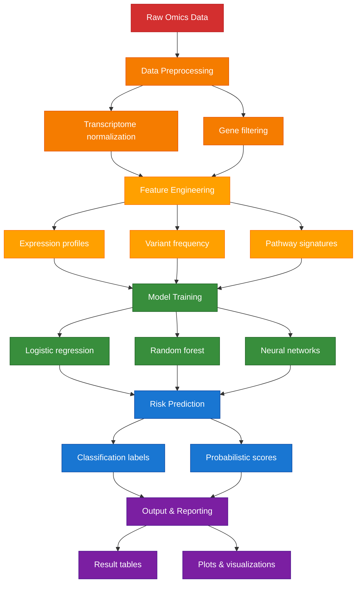

# Kabosu

[](LICENSE)


---
## Mission
To revolutionize personalized medicine by integrating multi-omics data, deep learning, and pharmacological bioinformatics to predict disease risk, help physicians and doctor diagnose conditions with more accuracy, and recommend optimal therapies and treatments. 

Inspired by Kabosu, the Doge meme icon - symbolizing the project's mission to bring joy and hope through better healthcare. 🐕💊

---
## Current Status
**Project Status: Active Development**
Kabosu is currently in active development. The core machine learning pipeline is established, and we are focused on enhancing model performance and expanding our dataset.

**Current Implementation**
- Preprocessing Pipeline: Complete. Handles data cleaning, normalization, scaling, and feature selection for genomic data.

- Model Development:
    - Random Forest: A robust, interpretable baseline model. Hyperparameter tuning has been performed to optimize performance.
    - Neural Network: A deep learning model (2-layer architecture with dropout regularization) is implemented for complex pattern recognition.

- Current Focus: Debugging and improving model performance, specifically addressing challenges like class imbalance and overfitting.

**Data Acquisition & Curation**
To build a powerful and generalizable model, we are aggregating a large-scale, diverse dataset.

- Data Mining: Actively curating relevant public datasets to enhance the quality and quantity of training data.

- Data Scraping: Developing automated tools to extract structured genomic, transcriptomic, proteomic, and clinical data from trusted public repositories including:

    - NIH (National Institutes of Health)
    - NCBI (National Center for Biotechnology Information)
    - TCGA (The Cancer Genome Atlas)

**Automation & Workflow**
- Snakemake Pipeline: We are building a scalable and reproducible workflow using Snakemake. This pipeline will automate the entire process from raw data preprocessing to model training and final result generation, ensuring consistency and ease of use.


---
## Key Features (Planned)
- **Multi-Omics Integration**: Combine transcriptomics, genomics, and clinical data
- **Disease Prediction**: Machine learning models for risk assessment and diagnosis
- **Therapy Recommendations**: AI-driven personalized treatment suggestions
- **In Silico Testing**: Simulate drug effects on patient-specific pathways

---
## Roadmap 
- Phase 1: Data preprocessing pipeline (complete)
- Phase 2: Baseline ML models (In progress)
- Phase 3: Deep learning integration (In progress)
- Phase 4: Web interface deployment (Pending)



---
## Current Development Flowchart



---
## Technical Stack 
| Component          | Technology Stack                  | Version     |
|--------------------|-----------------------------------|-------------|
| Data Processing    | pandas, numpy, PySAM              | 2.0.3       |
| Machine Learning   | TensorFlow, scikit-learn          | 2.12.0      |
| Visualization      | Matplotlib, Plotly, Seaborn       | 3.7.1       |
| Deployment         | Flask, Google Cloud               | 2.3.2       |


---
## Installation

### Prerequisites
- Python 3.9+
- pip
- conda 

### Setup
```bash
# Clone the repository
git clone https://github.com/Aridoge13/Kabosu

# Create and activate conda environment (recommended)
conda create -n kabosu python=3.9
conda activate kabosu

# Install core dependencies
pip install biopython matplotlib pandas numpy pysam seaborn scikit-learn tensorflow shap joblib snakemake

# If you are unable to install tensorflow with pip, please activate the conda environment and install the dependencies on conda

# Installing core dependencies on conda 
conda install biopython matplotlib pandas numpy pysam seaborn scikit-learn tensorflow shap joblib
```
---
## Contribution
Contributions are welcome. Please submit issues or pull requests following the project guidelines.

---
### Contributing
We welcome contributions! Please:
1. Fork the repository
2. Create your feature branch (git checkout -b feature/AmazingFeature)
3. Commit your changes (git commit -m 'Add some AmazingFeature')
4. Push to the branch (git push origin feature/AmazingFeature)
5. Open a Pull Request

---
## License
See [LICENSE](License.md) for full terms.

---
## Contact
For questions or support, 
please contact: aritra.mukherjee98@gmail.com

