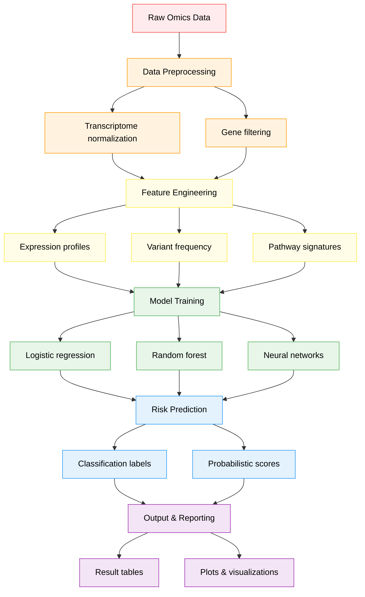

# Kabosu

[](LICENSE)

## Mission
To revolutionize personalized medicine by integrating multi-omics data, deep learning, and pharmacological bioinformatics to predict disease risk, diagnose conditions, and recommend optimal therapies.


## Current Status
**Active Development**: The preprocessing pipeline has been built and we are currently curating training data from public datasets 

## Key Features (Planned)
- **Multi-Omics Integration**: Combine transcriptomics, genomics, and clinical data
- **Disease Prediction**: Machine learning models for risk assessment and diagnosis
- **Therapy Recommendations**: AI-driven personalized treatment suggestions
- **In Silico Testing**: Simulate drug effects on patient-specific pathways

## Roadmap 
- Phase 1: Data preprocessing pipeline
- Phase 2: Baseline ML models (Pending)
- Phase 3: Deep learning integration (Pending)
- Phase 4: Web interface deployment (Pending)

## Current Development Flowchart



## Technical Stack 
| Component          | Technology Stack                  | Version     |
|--------------------|-----------------------------------|-------------|
| Data Processing    | pandas, numpy, PySAM              | 2.0.3       |
| Machine Learning   | TensorFlow, scikit-learn          | 2.12.0      |
| Visualization      | Matplotlib, Plotly, Seaborn       | 3.7.1       |
| Deployment         | Flask, Google Cloud               | 2.3.2       |


## Installation

### Prerequisites
- Python 3.9+
- pip
- conda 

### Setup
```bash
# Clone the repository
git clone https://github.com/Aridoge13/Kabosu

# Create and activate conda environment (recommended)
conda create -n kabosu python=3.9
conda activate kabosu

# Install core dependencies
pip install biopython matplotlib pandas numpy pysam seaborn scikit-learn tensorflow 
```

## Contribution
Contributions are welcome. Please submit issues or pull requests following the project guidelines.

### Contributing
We welcome contributions! Please:
1. Fork the repository
2. Create your feature branch (git checkout -b feature/AmazingFeature)
3. Commit your changes (git commit -m 'Add some AmazingFeature')
4. Push to the branch (git push origin feature/AmazingFeature)
5. Open a Pull Request


## License
See [LICENSE](License.md) for full terms.

## Contact
For questions or support, 
please contact: aritra.mukherjee98@gmail.com


## Message 
Inspired by Kabosu, the Doge meme icon - symbolizing the project's mission to bring joy through better healthcare. 🐕💊